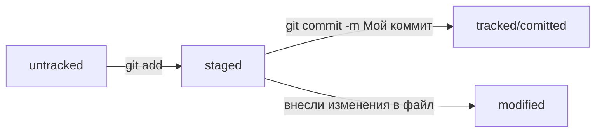

# GitHowTo

Эта инструкция должна помочь в первоначальной установке Git и настройке первого репозитория.

> Это руководство рассчитано на то, что вы уже имеете базовое представление о работе с командной строкой.

## Что такое Git?

Система контроля версий, или VCS (англ. Version Control System, или коротко VCS), — это программное обеспечение, которое помогает отслеживать изменения в программах, текстовых файлах, больших документах, веб-сайтах и так далее.

> Для обозначения систем контроля версий используют не только аббревиатуру VCS, но и SCM (от англ. Source Control Management — «система управления исходным кодом»).

Git один из таких продуктов.

## Установка Git

В зависимости от вашей операционной системы, процесс установки может отличаться, но сам процесс довольно простой.

### Windows
Если вы пользователь Windows, то Git у вас уже есть. Вы установили его в составе пакета Git for Windows вместе с командной строкой.

Убедитесь в этом. Откройте консоль и выполните эту команду.
```bash
git version
```
Если Git установлен правильно, консоль выведет его текущую версию. 

### macOS

Для установки Git на macOS существует два способа. Здесь я расскажу только про первый.

Откройте консоль и выполните команду `/usr/bin/git`. Она запустит установщик. Нажмите *Install* и дождитесь окончания установки.

Когда установка завершится, для проверки выполните эту команду.
```bash
git version
```
Если на экран выводится текущая версия Git, значит, установка прошла успешно.

## Как сделать папку репозиторием

Чтобы Git начал отслеживать изменения в проекте, папку с файлами этого проекта нужно сделать Git-репозиторием.

Для этого следует переместиться в неё и ввести команду `git init`.

Если вы видите сообщение `Initialized empty Git repository in <*ваша папка с проектом*>/.git/`, значит все прошло хорошо.

Готово! Репозиторий инициализирован.

Команда `git init` — одна из редко применяемых, ведь репозиторий создаётся один раз, а пользоваться им можно сколько угодно долго.

### «Разгитить» папку, если что-то пошло не так

Если вы случайно сделали Git-репозиторием не ту папку, её можно «разгитить». Для этого нужно удалить скрытую подпапку `.git`.

	$ cd <папка с репозиторием> # перешли в папку

	$ rm -rf .git # удалили подпапку .git

Будьте осторожны: в подпапке `.git` хранится история изменений. Если удалить `.git`, то вся история проекта будет стёрта без возможности восстановления — останется только последняя версия файлов.

## Проверить состояние репозитория — git status

После инициализации репозитория запустите команду `git status` — она показывает текущее состояние репозитория.

Команда `git status` выведет:
- название текущей ветки: `On branch master` или `On branch main`;
- сообщение о том, что в репозитории ещё нет коммитов: `No commits yet`;
- сообщение, которое говорит: «чтобы что-нибудь закоммитить, нужно сначала это создать» — `nothing to commit (create/copy files and use "git add" to track)`.

В отличие от `git init`, команду `git status` используют часто. В любой непонятной ситуации стоит посмотреть состояние (статус) репозитория, а потом решить, что делать дальше.

## Подготовить файлы к сохранению

Команда `git add` запоминает текущее содержимое (контент) файла (подготавливает файлы к коммиту).

> Команда `git add` используется в Git для добавления изменений в *индекс (staging area)* перед фиксацией (`git commit`). Это первый шаг в процессе сохранения изменений.

1. Добавить конкретный файл
```bash
git add file.txt
```
Добавляет `file.txt` в индекс.

2. Добавить несколько файлов
```bash
git add file1.txt file2.txt
```
Добавляет несколько указанных файлов.

3. Добавить все измененные файлы в текущей папке
```bash
git add
```
Добавляет *все новые и измененные файлы* (не включает удаленные файлы).

4. Добавить все файлы (включая удаленные)
```bash
git add -A
```
Эквивалентно `git add --all`. Добавляет *все файлы*, включая удаленные.

5. Добавить все файлы в текущей папке и вложенных папках
```bash
git add *
```
Добавляет все файлы, кроме скрытых (.gitignore тоже влияет).

---

Есть и другие команды, но это основные.

## Выполнить коммит

Сделать коммит можно командой `git commit` c ключом `-m`, который присваивает коммиту сообщение.

Обычно в таком сообщении поясняется, в чём именно состояли изменения. Это как заметки на полях: благодаря им проще читать и понимать текст. Сообщение коммита выполняет те же функции — улучшает понимание и упрощает навигацию. Оно пишется после ключа `-m` в кавычках.

Например:
```bash
git commit -m ‘Мой первый коммит!’
```

## Просмотреть историю коммитов

Чтобы увидеть историю коммитов, введите команду `git log`.

Обратите внимание, что по умолчанию `git log` выводит коммиты в обратном хронологическом порядке — последние коммиты оказываются первыми сверху. В этом можно убедиться, если посмотреть на дату и время их создания.

## Привязать удалённый репозиторий к локальному

> Инструкция рассчитана на тех, кто уже создал удаленный репозиторий и привязал SSH ключ.

Перейдите на страницу своего удалённого репозитория, выберите тип SSH и скопируйте URL.

Откройте консоль, перейдите в каталог локального репозитория и введите команду `git remote add`.
```bash
$ cd ~/dev/first-project
$ git remote add origin git@github.com:%ИМЯ_АККАУНТА%/first-project.git
```

Команде необходимо передать два параметра: имя удалённого репозитория и его URL. В качестве имени используйте слово `origin`. А URL вы скопировали со страницы удалённого репозитория.

> `origin` — стандартный псевдоним, с помощью которого можно обращаться к главному удалённому репозиторию (обычно такой репозиторий один). Это значительно упрощает работу.

### Убедиться, что репозитории связаны, — `git remote -v`

Отлично: вы связали локальный репозиторий с удалённым. Осталось убедиться, что всё работает, с помощью следующей команды.
```bash
$ git remote -v
origin    git@github.com:%ИМЯ_АККАУНТА%/%ИМЯ-ПРОЕКТА%.git (fetch)
origin    git@github.com:%ИМЯ_АККАУНТА%/%ИМЯ-ПРОЕКТА%.git (push)
```

В выводе вы должны увидеть две строчки, аналогичные тем, что показаны выше.

> Флаг `-v` — короткая форма флага `--verbose`. Он позволяет показать больше информации в выводе.

## Отправить изменения на удалённый репозиторий

Вы уже прошли весь «цикл коммита»: подготовили файлы с помощью `git add`, закоммитили их с комментарием командой `git commit -m`. Осталось загрузить содержимое локального репозитория на удаленный. За это отвечает команда `git push`.

В первый раз эту команду нужно вызвать с флагом `-u` и параметрами `origin` (имя удалённого репозитория) и `main` или `master` (название текущей ветки). Флаг `-u` свяжет локальную ветку с одноимённой удалённой. Как вы связывали локальный и удалённый репозитории в предыдущем уроке, так же и здесь нужно дополнительно связать ветки.
```bash
$ git push -u origin main # Если команда приведёт к ошибке, попробуйте 
                          # заменить main на master.
```

Зайдите в свой удаленный репозиторий. Вы увидите, что в репозитории появились файлы с изменениями.

В дальнейшем при работе с удалённым репозиторием флаг `-u` можно опустить и писать просто `git push`.

## Что такое хеш. Хеширование коммитов

**Хеширование** — это способ преобразовать набор данных и получить их «отпечаток».

Информация о коммите — это набор данных: когда был сделан коммит, содержимое файлов в репозитории на момент коммита и ссылка на предыдущий, или **родительский**, коммит.


Git хеширует (преобразует) информацию о коммите с помощью алгоритма **SHA-1** (от англ. Secure Hash Algorithm — «безопасный алгоритм хеширования») и получает для каждого коммита свой уникальный **хеш** — результат хеширования.

Обычно хеш — это короткая (40 символов в случае SHA-1) строка, которая состоит из цифр `0—9` и латинских букв `A—F` (неважно, заглавных или строчных). Она обладает следующими важными свойствами:
- если хеш получить дважды для одного и того же набора входных данных, то результат будет гарантированно одинаковый;
- если хоть что-то в исходных данных поменяется (хотя бы один символ), то хеш тоже изменится (причём сильно).

### Хеш — основной идентификатор коммита

Git хранит таблицу соответствий `хеш → информация о коммите`. Если вы знаете хеш, вы можете узнать всё остальное: автора и дату коммита и содержимое закоммиченных файлов. Можно сказать, что хеш — основной идентификатор коммита.

При работе с Git хеши будут встречаться вам регулярно. Их можно будет передавать в качестве параметра разным Git-командам, чтобы указать, с каким коммитом нужно произвести то или иное действие.

Все хеши и таблицу `хеш → информация о коммите` Git сохраняет в служебные файлы. Они находятся в скрытой папке `.git` в репозитории проекта.

## Подробнее про логи

После вызова `git log` появляется список коммитов.


Элементы, из которых состоит описание:
- строка из цифр и латинских букв после слова **commit** — это хеш коммита;
- **Author** — имя автора и его электронная почта;
- **Date** — дата и время создания коммита;
- в конце находится сообщение коммита.

### Получить сокращённый лог — `git log --oneline`

Получить сокращённый лог можно с помощью команды `git log` с флагом `--oneline`. В терминале появятся только первые несколько символов хеша каждого коммита и их комментарии.

Сокращённый лог полезен, если в репозитории уже много коммитов — например, сотни или тысячи. В этом случае можно быстро найти нужный по описанию.

## Файл `HEAD`

Файл `HEAD` — один из служебных файлов папки `.git`. Он указывает на коммит, который сделан последним (то есть на самый новый).

Внутри `HEAD` — находится ссылка на служебный файл: `refs/heads/master` (или `refs/heads/main` в зависимости от названия ветки). Если заглянуть в этот файл, можно увидеть хеш последнего коммита.
```bash
$ cat refs/heads/master # взяли ссылку из файла HEAD
# внутри хеш
e007f5035f113f9abca78fe2149c593959da5eb7

$ git log 
# сверяем с хешем последнего коммита
commit e007f5035f113f9abca78fe2149c593959da5eb7
Author: John Doe <johndoe@example.com>
Date:   Tue Mar 28 00:26:53 2023 +0300

    Добавить амбиций в список дел

... # другие коммиты
```

Когда вы делаете коммит, Git обновляет `refs/heads/master` — записывает в него хеш последнего коммита. Получается, что `HEAD` тоже обновляется, так как ссылается на `refs/heads/master`.

## Статусы файлов в Git

Одна из ключевых задач Git — отслеживать изменения файлов в репозитории. Для этого каждый файл помечается каким-либо статусом. Рассмотрим основные.

- `untracked` - Git «видит», что такой файл существует, но не следит за изменениями в нём. У `untracked`-файла нет предыдущих версий, зафиксированных в коммитах или через команду `git add`.
- `staged` - После выполнения команды `git add` файл попадает в **staging area**, то есть в список файлов, которые войдут в коммит. В этот момент файл находится в состоянии `staged`.

> Staging area также называют **index** или **cache**, а состояние файла `staged` иногда называют `indexed` или `cached`.

- `tracked` - это противоположность `untracked`. Оно довольно широкое по смыслу: в него попадают файлы, которые уже были зафиксированы с помощью `git commit`, а также файлы, которые были добавлены в staging area командой `git add`. То есть все файлы, в которых Git так или иначе отслеживает изменения.
- `modified` - Git сравнил содержимое файла с последней сохранённой версией и нашёл отличия. Например, файл был закоммичен и после этого изменён.

> Для файлов в состояниях `staged` и `modified` обычно не указывают, что они также `tracked`, потому что это состояние подразумевается.



## Оформление сообщений к коммитам

То, как написаны сообщения коммитов, тоже может подчиняться определённым правилам. Иногда эти правила продиктованы культурой команды, а иногда техническими ограничениями.

Например, в выводе команды `git log --oneline` умещается максимум 72 первых символа сообщения, поэтому многие правила включают пункт: «Сообщение не должно быть длиннее 72 символов».

Есть общие рекомендации по тому, как правильно составить сообщение. Оно должно быть:
- относительно коротким, чтобы его было легко прочитать;
- информативным;
- все сообщения оформлены в одном стиле.

> Вот пример полезного сообщения в репозитории новостного сайта: `Исправление опечатки в заголовке главной страницы на хорватском`.

### Корпоративный подход

Во многих компаниях применяется **Jira** — система для организации проектов и задач. У каждой задачи в Jira есть идентификатор из нескольких заглавных латинских букв и номера. Например, `LGS-239` значит, что это 239-я задача в проекте LGS.

В корпоративном стиле в начале сообщения обычно указывают Jira-ID, а после — текст сообщения.
```bash
$ git commit -m "LGS-239: Дополнить список пасхалок новыми числами"
```

> **Инфинитив и императив**
Для сообщений на русском языке часто рекомендуют использовать **инфинитивы**. Например: `Добавить тесты для TestService`, `Исправить ошибку #123` и так далее.
Для сообщений на английском рекомендуется использовать **повелительное наклонение** (англ. imperative). Например: `Use library mega_lib_300`, `Fix exit button` и так далее.
Эти рекомендации сложились исторически, и им следуют многие проекты.